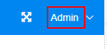

<!--
 * @Author: Zhang Qing
 * @Date: 2020-07-02 17:24:07
 * @LastEditTime: 2020-07-06 09:14:41
 * @LastEditors: your name
 * @Description: 
 * @FilePath: \PersonalBlog_Web\README.md
--> 


# PersonBlog_Web

## Project setup
```
npm install
```

### Compiles and hot-reloads for development
```
npm dev
```

### Compiles and minifies for production
```
npm build
```

### Lints and fixes files
```
npm lint
```

### Customize configuration
See [Configuration Reference](https://cli.vuejs.org/config/).

## Tips需要优化的地方（2020/07/04）
1. 关于图片的处理 都还没实现
2. 关于登录登出
3. category里的某些接口有问题




